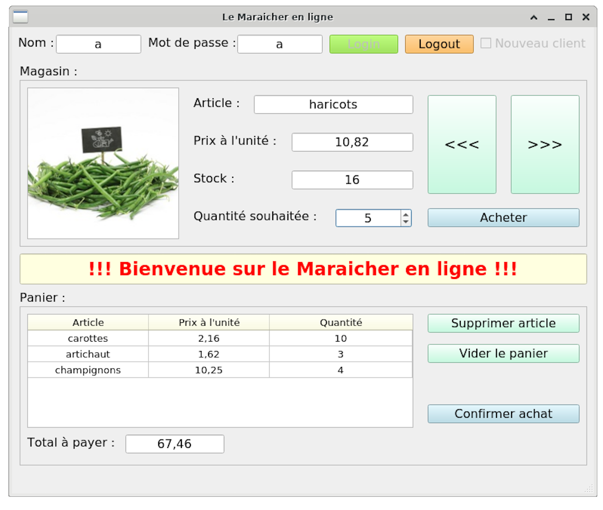

# Maraîcher en ligne

This project was carried out as part of an academic initiative aimed at deepening my programming knowledge and putting the studied concepts into practice.

## Global Application Overview

The overall application consists of multiple servers and clients written in various programming languages and imposed paradigms. Here is the global overview of the application:

# Purchase Section

The "Purchase Section" describes the protocol used for communication between the client (written in C or Java) and the server (written in C) to perform transactions on the 'Maraîcher en ligne' platform. The protocol includes commands such as login, item consultation, adding to cart, order confirmation, etc. The server is a multi-threaded C program using sockets for communication, exchanging strings terminated by specific symbols to delimit messages. Clients are available in C (ClientQT), Java (ClientJava), and for Android mobile application (ClientMobile), all allowing navigation in the online store, filling the cart, and confirming the order, interacting with the purchase server.

Protocol for communication between the client (C or Java) and the server (C) to place an order on the 'Maraîcher en ligne' platform.

| Command    | Request                                  | Response                                | Actions / Explanations                                                                                                                                                                                                                                      |
|------------|------------------------------------------|-----------------------------------------|-------------------------------------------------------------------------------------------------------------------------------------------------------------------------------------------------------------------------------------------------------------|
| Login      | Login, password, new client or not       | Yes or no, message or reason            | Verification of the existence and password of the client / Creation of a new client in the clients table                                                                                                                                               |
| Consult    | idArticle                                | idArticle or -1, title, stock, price, image | Consultation of an article in the database → if article not found, return -1 to the client                                                                                                                                                                                |
| Purchase   | idArticle, quantity                     | idArticle or -1, quantity or 0, price   | If article not found, return -1. If found but insufficient stock, return a quantity of 0 → If ok, the stock is updated in the database and the contents of the shopping cart are memorized at the server level → currently no action on invoices and sales tables |
| Cart       | /                                        | Content of the cart: (idArticle, title, quantity, price) × number of items in the cart | Returns the entire contents of the cart to the client                                                                                                                                                                                                      |
| Cancel     | idArticle                                | Yes or no                               | Removes an article from the cart and updates the database                                                                                                                                                                                                   |
| Cancel All | /                                        | /                                       | Removes all items from the cart and updates the database                                                                                                                                                                                                   |
| Confirm    | /                                        | Generated invoice number                | Creation of an invoice and database and addition of items from the cart to the database                                                                                                                                                                    |
| Logout     | /                                        | /                                       | If cart in progress, empties the cart and updates the database                                                                                                                                                                                             |

## Purchase Server (lib and serveur.cpp)

This is a multi-threaded C server that can be queried by multiple applications written in different languages. This server uses sockets for communication, exchanging strings of characters terminated by the '#' and ')' symbols to delimit messages. The server will have access to a MySQL database with clients, invoices, and articles.

## Purchase Client C (lib and ClientQT)

The client can browse the pages of the online store, fill their cart, and then confirm their order. All this will of course be done through a dialogue with the Purchase Server. The graphical interface was created using [QT](https://www.qt.io/).

## Purchase Client Java (ClientJava)

This is the same as the C client but written in Java. It still communicates with the purchase server and allows the same actions as the C client. The graphical interface was developed using Java Swing and [FlatLaf](https://www.formdev.com/flatlaf/).

## Android Mobile Java Purchase Application (ClientMobile)

This is the same as the C and Java clients but designed to run on an Android device and communicate with the purchase server.

# Payment Section

The "Payment Section" presents two protocols for communication between the client (Java) and server (Java) to process payments on the 'Maraîcher en ligne' platform. The first protocol, named 'VEgetables Shopping PAyment Protocol (VESPAP)', allows unsecured communications, while the second, named 'VEgetables Shopping PAyment Protocol Secure (VESPAPS)', ensures secure communications. These protocols include commands such as login, fetching invoices, paying invoices, and logging out. The payment server is a multi-threaded Java program listening on several ports, including an encrypted port using TLSv1.2. The server communicates with sockets and exchanges Java objects implementing the 'Request' and 'Response' interfaces. Two clients are presented: 'ClientPaiment', used by an in-store employee to pay invoices, and 'ClientPaimentSecure', allowing clients to pay their invoices from home, with secure application-level communication via certificates.

### « VEgetables Shopping PAyment Protocol (VESPAP) : 

Protocol for communication between the client (Java) and server (Java) to pay for an order from the Maraîcher en ligne.

| Command    | Request                             | Response                                 | Actions / Explanations                                 |
|------------|-------------------------------------|------------------------------------------|--------------------------------------------------------|
| Login      | Login, password, (of an employee)   | Yes or no                                | Verification of login and password in the employees table |
| Get Invoices | idClient (provided by the client on-site) | List of invoices (idInvoice, date, amount, paid) | Simply retrieves the client's invoices from the invoices table (without detailed order content) |
| Pay Invoices | idInvoice, name and VISA card number | Yes or no (invalid VISA card)            | The server simply checks the validity of the card number → if ok, the payment is considered complete |
| Logout     | /                                   | /                                        | /                                                      |               

### « VEgetables Shopping PAyment Protocol Secure (VESPAPS) : 

Protocol for communication between the client (Java) and server (Java) to pay for an order from the 'Maraîcher en ligne' securely.

| Command    | Request                             | Response                                 | Actions / Explanations                                 |
|------------|-------------------------------------|------------------------------------------|--------------------------------------------------------|
| Login      | Login, password, (of an employee) -> **handshake for sending a session key**   | Yes or no -> **receipt of a session key** | Verification of login and password in the employees table. **Should not transit in clear over the network -> salted digest** |
| Get Invoices | idClient + **client signature** | List of invoices (idInvoice, date, amount, paid) **symmetrically encrypted** | Simply retrieves the client's invoices from the invoices table (without detailed order content) |
| Pay Invoices | idInvoice, name and VISA card number, all **symmetrically encrypted** | Yes or no (invalid VISA card) + **HMAC of the response** | The server simply checks the validity of the card number → if ok, the payment is considered complete |
| Logout     | /                                   | /                                        | /                                                      |               

## Payment Server (PaiementServeur)

This is a multi-threaded Java server listening on several ports:

* **PORT_PAYMENT**: Thread pool server with unencrypted listening port. All communications are in plain text.
* **PORT_PAYMENT_SECURE**: On-demand thread server with an encrypted listening port at the application layer symmetrically using the [Bouncy Castle](https://www.bouncycastle.org/) library.
* **PORT_PAYMENT_TLS**: Thread pool server with a listening port encrypted with TLSv1.2.

All these ports and pool sizes are defined in `config.properties`.

This server also communicates with sockets, but data exchanges will be done with Java objects implementing the `Request` and `Response` interfaces.

The server has access to a MySQL database where there will be employees, invoices, and clients.

## Payment Client (PaiementClient)

This is a Java client used by an employee who welcomes customers coming to pay an invoice and retrieve the corresponding order. With the customer's spoken client number, the employee can then connect to the payment server and obtain all unpaid invoices for the client. The client then specifies which invoice (and therefore which order) they want to pay. Then, the client provides the employee with their VISA card details (name + card number). The employee then sends this information to the payment server, which simply checks if the card number is valid. The interface is still made with Java Swing and [FlatLaf](https://www.formdev.com/flatlaf/).

Upon launching the application, the user has the choice of whether to connect to the servers with a secure connection using TLSv1.2.

## Secure Payment Client (PaiementClientSecure)

This is a modified version of the payment client as it allows store customers to pay an invoice from home before going to collect their order at the store. So the customer can connect, view their invoices, and already settle them at home. All communication with the server will be encrypted at the application level with the exchange of a session key asymmetrically encrypted using certificates.

# Stock Management Section

## Web Service (WebService)

This is an HTTP and HTTPS Java server "from scratch". We use the `HttpServer` class and the `HttpHandler` interface from the `com.sun.net.httpserver` package. It also has an API allowing requests to the MySQL database.

It allows the user from their browser to change the price and quantity of stock items available in the database.

| Method | Request                 | Response                                     |
|--------|-------------------------|-----------------------------------------------|
| GET    |                         | List of all items in JSON format             |
| POST   | idItem, price, stock    | Yes or no in text format                      |

---

# Running the Application

### MySQL Database

To have the tables in your MySQL database and some test data, change the `BD_Maraicher/CreationDB.cpp` file to connect to the MySQL database, then on Linux run `make CreationBD` and execute `./BD_Maraicher/CreationDB`.

For the Java servers to access the database, you will need to put the MySQL drivers in their respective projects.

### Purchase Server

On Linux, change `server.cpp` to connect to the MySQL database, then run `make` and execute `./Server`.

### Purchase Client in C

On Linux, run `make` and execute `./Client`.

### Java Client

Launch the project in IntelliJ and run `Main.java`. You can change the `config.properties` to set the IP and port of the purchase server.

### Android Client

Open the project in Android Studio and compile the project.

### Payment Server

Create a keystore (server.jks) with an RSA key pair and the certificate of `ClientPaimentSecure`, and another keystore (serveurTLS.jks) with a key pair and the certificate of `ClientPaiment`. Put both keystores in `ServeurPaiement`. Then open the project in IntelliJ and compile it. Don't forget to change `ServeurVESPAP.java` so the server can connect to the

 MySQL database.

### Payment Client

Create a keystore (client.jks) with a key pair and the certificate of the payment server (`serveurTLS.jks`). Put the keystore in `ClientPaiement`. Then open the project in IntelliJ and compile it.

### Secure Payment Client

Create a keystore (client.jks) with a key pair and the certificate of the payment server (`serveur.jks`). Put the keystore in `ClientPaiementSecure`. Then open the project in IntelliJ and compile it.

### Web Service

Create a keystore (serveur.jks) with a key pair. Put the keystore in `ServiceWeb`. Then open the project in IntelliJ and compile it.